# FreeFileSync-文件同步方案

## Linux下安装FreeFileSync

官网下载：https://freefilesync.org/

选择Linux版本


```sh
#上传到服务器
#解压安装包
tar -zxvf FreeFileSync_12.4_Linux.tar.gz
```

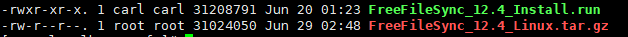

```shell
#执行安装命令
./FreeFileSync_12.4_Install.run

#按提示输入y即可，按回车
```

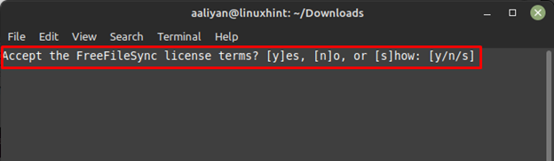

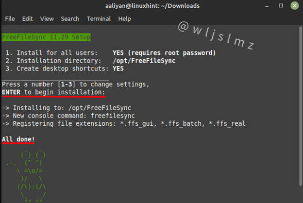

出现此提示，表示安装完成。

## FreeFileSync配置（支持配多个同步策略）

第一次配置，需要进入图形化界面操作。

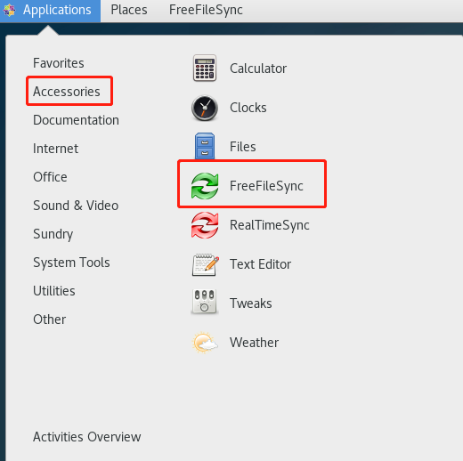

### 配置远程SFTP服务器信息

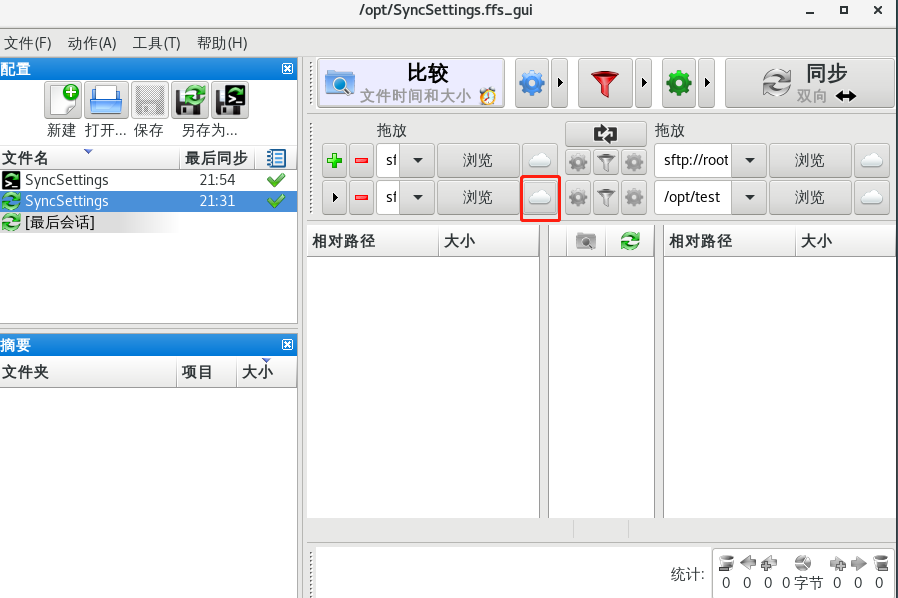

**配置服务器IP、端口、用户密码。需要同步的目录信息点击确认即可。**

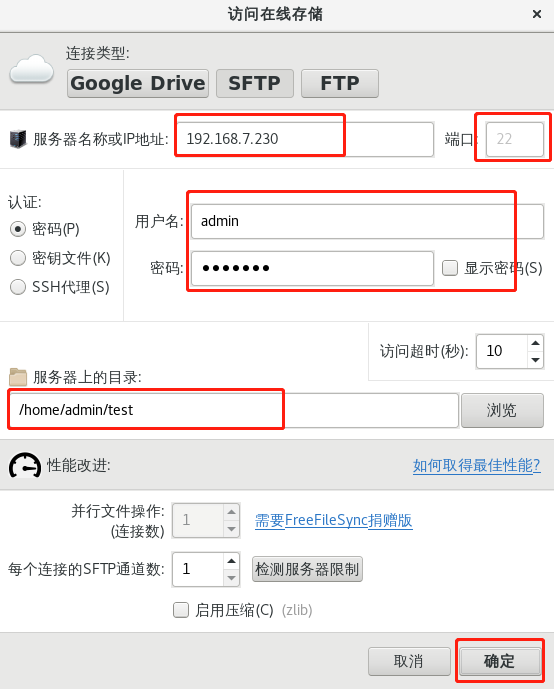

### 配置本地同步服务器同步地址

点击浏览，配置本机服务器目录。

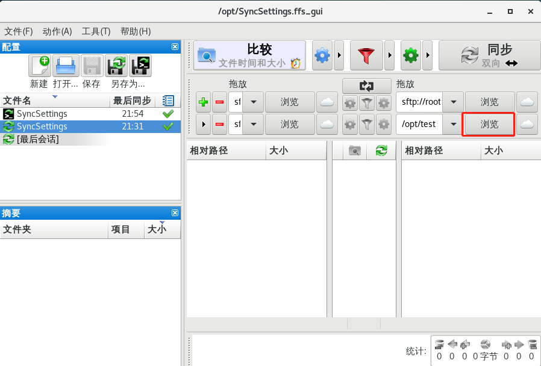

输入本机同步目录路径，点击open即可。

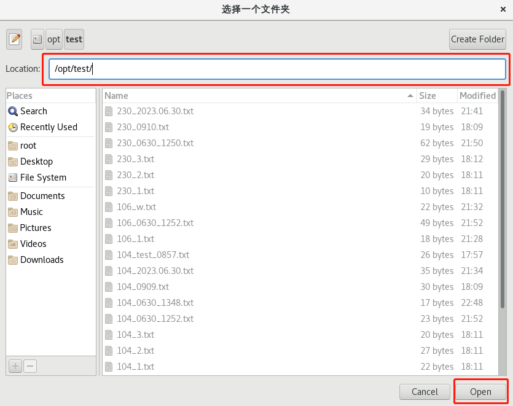

### 配置多组同步策略，点击+号即可

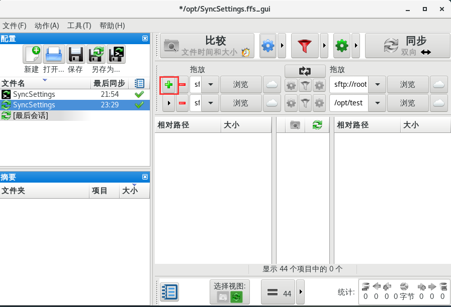

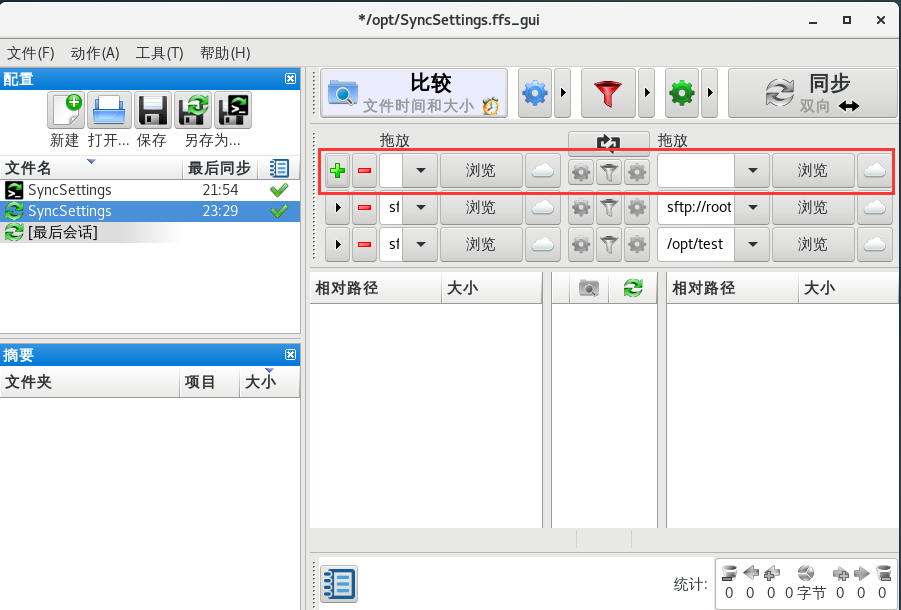

### 测试FreeFileSync是否同步成功

按顺序点击无报错信息即同步成功。

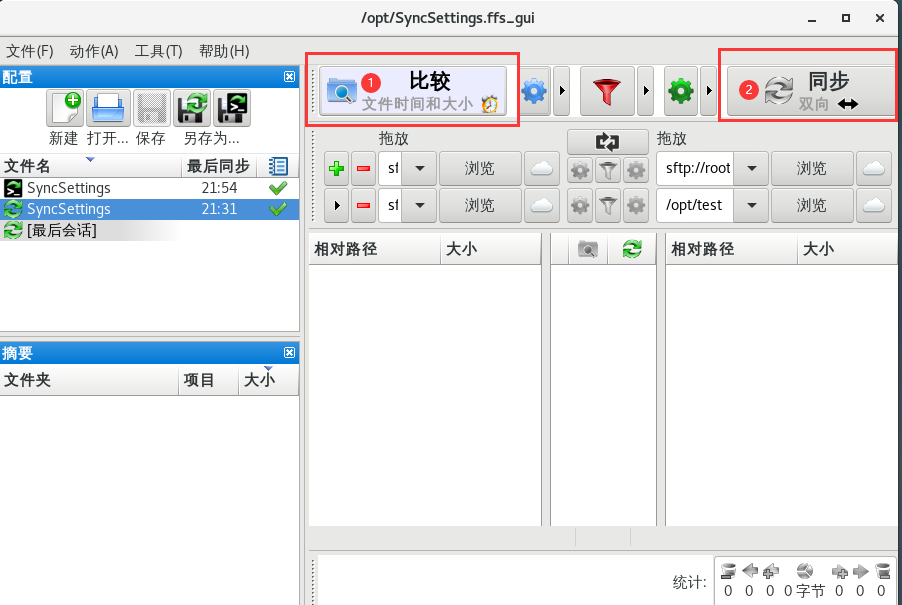


### 另存为批处理文件

文件->另存为批处理作业

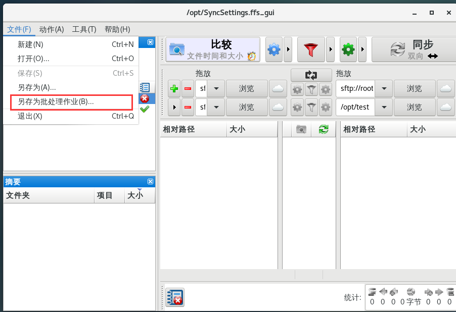

选中拉红框项，点击“另存为”即可。（最小化运行、自动关闭、忽略错误）

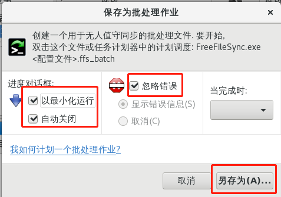

## 配置定时任务执行批处理作业

```sh
#配置cron任务
crontab -e 

#每2分钟执行批处理作业
#DISPLAY=:0 必须配置上，否则需要进行图形化操作
#/opt/FreeFileSync/FreeFileSync FreeFileSync程序路径
#/opt/SyncSettings.ffs_batch 批处理作业文件路径
*/2 * * *  * root DISPLAY=:0 /opt/FreeFileSync/FreeFileSync /opt/SyncSettings.ffs_batch
```

## 推荐FreeFileSync同步配置如下

### 分发配置（单向，左→右）

左：政务云服务器各单位附件文件路径；

右：政务内网各单位SFP服务器配置及其下发文件夹路径；

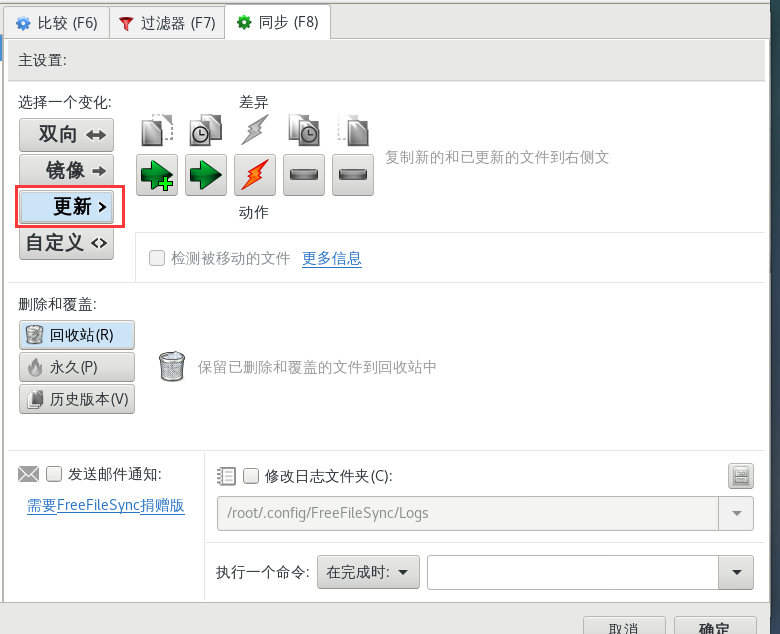

**复制新的和已更新的文件到右侧文件夹**；

### 收集配置（单向，左←右）

左：政务云服务器各单位附件文件路径；

右：政务内网各单位SFP服务器配置及其下发文件夹路径；

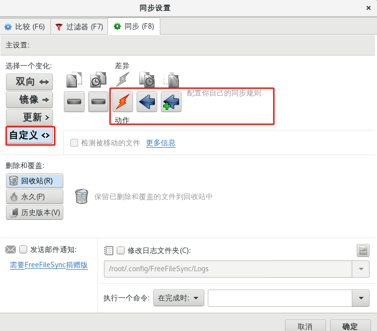

**复制新的和已更新的文件到左侧文件夹**；