# 搭建准备

Wire Guard-一键安装脚本地址：https://github.com/hwdsl2/wireguard-install/blob/master/README-zh.md

[WireGuard备用安装脚本]: https://github.com/Nyr/wireguard-install	"备用WireGuard脚本"

Wire Guard客户端下载：https://www.wireguard.com/install/

UDPspeeder：https://github.com/wangyu-/UDPspeeder/releases

udp2raw：https://github.com/wangyu-/udp2raw/blob/unified/doc/README.zh-cn.md

udp2raw-linux服务端下载地址：https://github.com/wangyu-/udp2raw/releases

udp2raw-windows客户端下载：https://github.com/wangyu-/udp2raw-multiplatform/releases


参考材料：

[UDPspeeder和udp2raw串联加速OpenVPN]: https://github.com/wangyu-/UDPspeeder/wiki/UDPspeeder%E5%92%8Cudp2raw%E4%B8%B2%E8%81%94%E5%8A%A0%E9%80%9FOpenVPN
[Yancey Wang-GitHub]: https://github.com/wangyu-


# 搭建Wire Guard 

## 服务端操作

连接境外VPS。

### 更新系统内核

```shell
#下载多功能脚本
yum install -y wget && wget raw.githubusercontent.com && chmod +x wireguard_install.sh && ./wireguard_install.sh
```

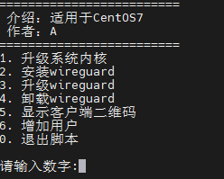

==**输入1，升级系统内核。升级完成后重启VPS。**==

### 安装Wire Guard 服务端

```shell
#下载一键安装脚本
wget -O wireguard.sh https://get.vpnsetup.net/wg

#赋予执行权限
chmod 775 *.sh

#执行 wireguard.sh 脚本
./wireguard.sh
```

==按提示操作即可。==

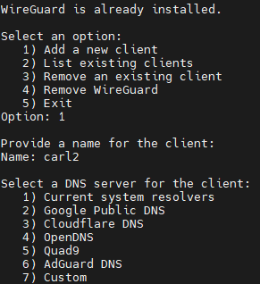

### 相关命令

```shell
#查看wireguard运行状态
wg

# 启动Wireguard
wg-quick up wg0
 
#关闭WIreguard
wg-quick down wg0
```

## 配置文件地址

> /etc/wireguard/wg0.conf

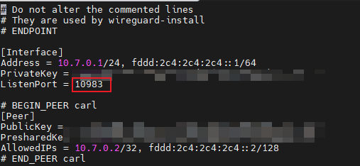

## 客户端配置

安装成功后可下载 xx.conf.文件，导入客户端程序中即可。

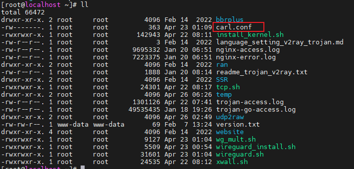

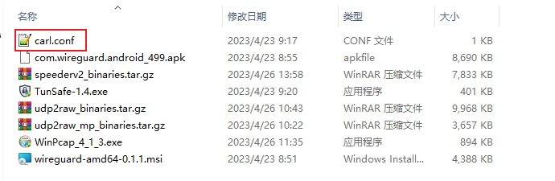

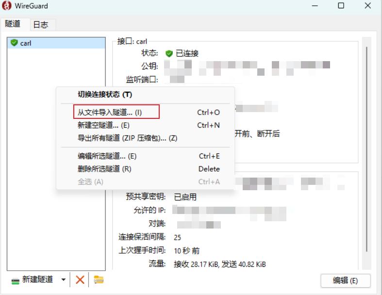

点击连接即可。

# 国内国外分流配置

[国内国外分流配置]: https://github.com/lmc999/auto-add-routes	"auto-add-routes"

## 开启WireGuard分流开关

1. 下载并安装最新版本的官方PC客户端。一般会安装在目录"C:\Program Files\WireGuard"
2. **开启Wireguard的Pre/Post命令支持**，只能通过修改注册表的方式开启，具体操作：
    以管理员身份运行cmd
    输入以下命令按回车

```bash
reg add HKLM\Software\WireGuard /v DangerousScriptExecution /t REG_DWORD /d 1 /f
```

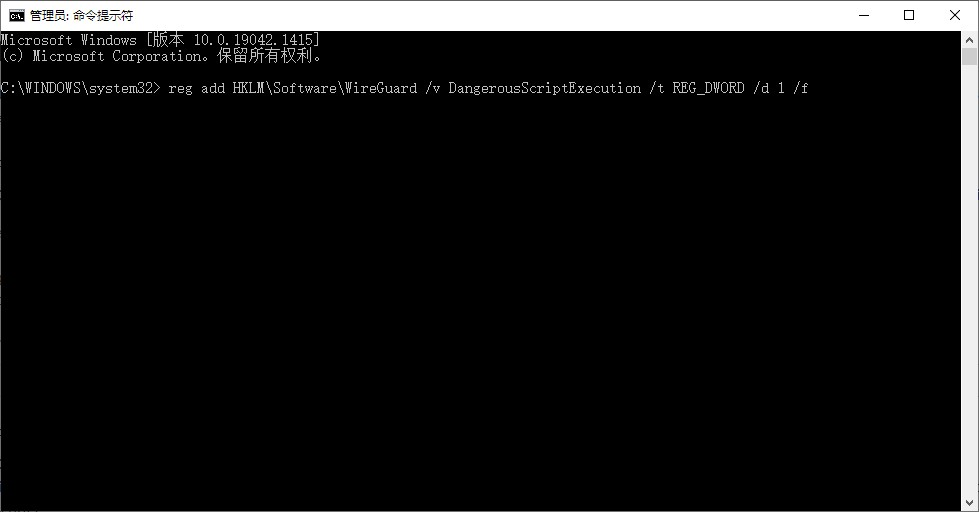

## 拷贝批处理文件

下载此页面中的所有文件到"C:\Program Files\WireGuard\bat"。或者直接下载解压此压缩档

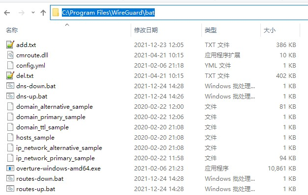

## 修改WireGuard客户端配置文件

加入以下Script Hook调用"C:\Program Files\WireGuard\bat"的批处理文件

```shell
PreUp = "C:\Program Files\WireGuard\bat\routes-up.bat"
PostUp = "C:\Program Files\WireGuard\bat\dns-up.bat"
PreDown = "C:\Program Files\WireGuard\bat\routes-down.bat"
PostDown = "C:\Program Files\WireGuard\bat\dns-down.bat"
```

## DNS 改为 127.0.0.1

```bash
DNS = 127.0.0.1
```

## 关闭Wire guard的kill switch并保存修改

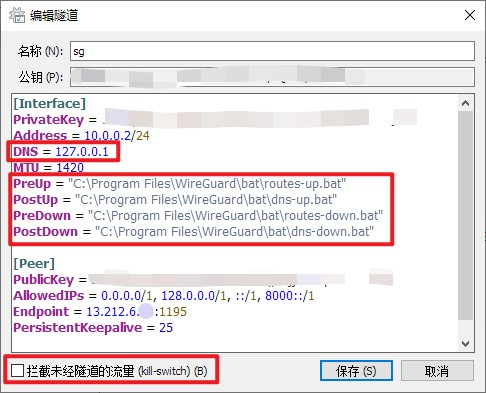

连接成功后可上[ip.skk.moe](https://ip.skk.moe/)测试一下看是否正确分流。

# UDP2raw伪装TCP流量

## 下载对应客户端

udp2raw：https://github.com/wangyu-/udp2raw/blob/unified/doc/README.zh-cn.md

udp2raw-linux服务端下载地址：https://github.com/wangyu-/udp2raw/releases

udp2raw-windows客户端下载：https://github.com/wangyu-/udp2raw-multiplatform/releases

## 服务端搭建

上传Linux客户端到VPS上

```shell
#创建对应的udp2raw文件夹
mkdir udp2raw

#解压
tar -zxvf udp2raw_binaries.tar.gz
```

### wg 查看 WireGuard 连接信息

```shell
wg
```

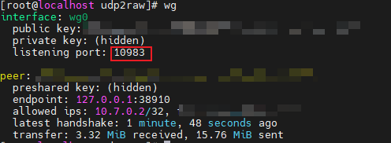

10983是 wire guard监听端口。

### Linux服务端启动udp2raw命令

```shell
#-l udp2raw映射TCP端口；-r wire guard监听端口;-k 密码
nohup ./udp2raw_amd64 -s -l0.0.0.0:10984  -r127.0.0.1:10983   -k "passwd" --raw-mode easyfaketcp
```

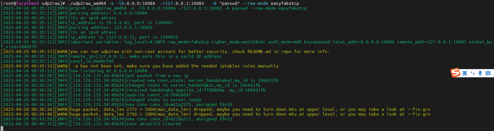

如图则启动成功。

## win客户端启动

### 下载依赖文件 WinPcap,安装

>udp2raw Windows客户端需要依赖WinPcap运行，先下载并安装WinPcap.
>
>https://www.winpcap.org/install/bin/WinPcap_4_1_3.exe

### WIN客户端启动命令

WIN + R，CMD 命令行，进入客户端目录地址。

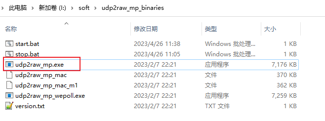

```shell
#-l0.0.0.0:10989 本地映射端口为10989;-rxx.xx.xx.xx:10984 连接服务器10984 udp2raw服务端映射端口；
udp2raw_mp.exe -c -l0.0.0.0:10989  -rxx.xx.xx.xx:10984 -k "passwd" --raw-mode easyfaketcp
```

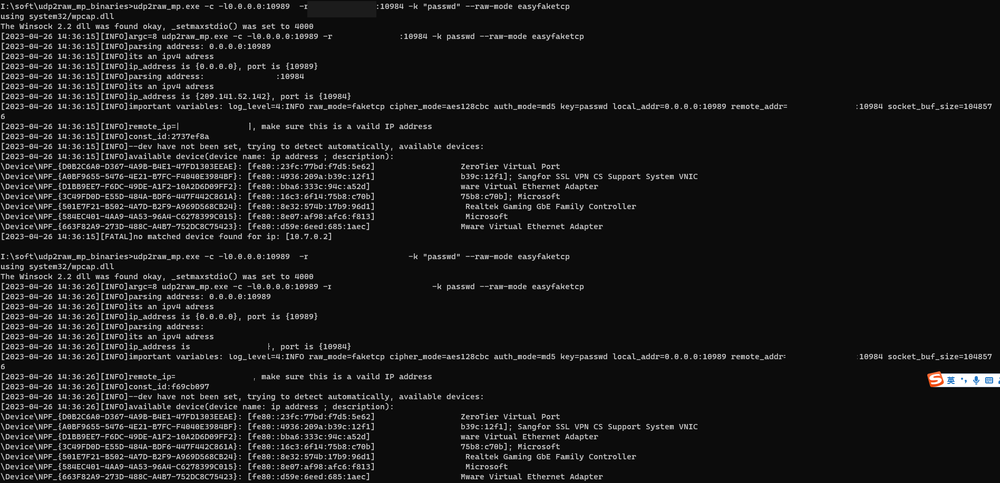

如图，运行成功。

## WireGuard客户端配置

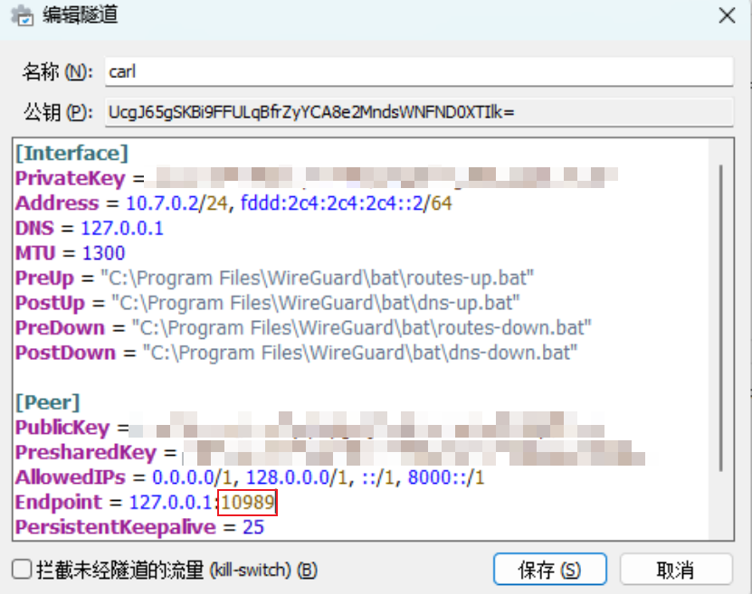

```shell
#对应win客户端udp2raw映射的端口10989
Endpoint = 127.0.0.1:10989
```

# WireGuard+UdpSpeeder+udp2raw 配置

参考材料：

[UDPspeeder和udp2raw串联加速OpenVPN]: https://github.com/wangyu-/UDPspeeder/wiki/UDPspeeder%E5%92%8Cudp2raw%E4%B8%B2%E8%81%94%E5%8A%A0%E9%80%9FOpenVPN

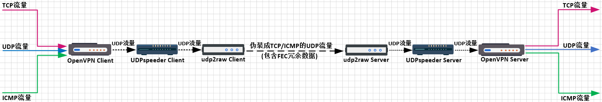

## 服务端配置

```shell
#假设你已经在VPS上配置好了WireGuard，WireGuard Server监听在udp的10983端口。假设VPS的IP是xx.xx.xx.xx。
nohup /root/udpspeeder/speederv2_amd64 -s -l127.0.0.1:10984  -r 127.0.0.1:10983 -f20:10 --mode 0 &
nohup /root/udp2raw/udp2raw_amd64 -s -l0.0.0.0:10989 -r 127.0.0.1:10984 -k "tnghu8k" --raw-mode easyfaketcp &
```

**speeder推荐配置**

`-f20:10`表示对每20个原始数据发送10个冗余包。`-f20:10` 和`-f 20:10`都是可以的，空格可以省略，对于所有的单字节option都是如此。对于双字节option，例如后面会提到的`--mode 0`，空格不可以省略。

`-k` 指定一个字符串，开启简单的异或加密

推荐使用`--mode 0`选项，否则你可能需要考虑MTU问题。

## 客户端配置

```shell
I:\soft\udp2raw_mp_binaries\udp2raw_mp.exe -c -l127.0.0.1:10356 -r xx.xx.xx.xx:10989 -k "tnghu8k" --raw-mode easyfaketcp

I:\soft\udp2raw_mp_binaries\speederv2.exe -c -l0.0.0.0:10458 -r 127.0.0.1:10356 -f20:10 --mode 0
```

==wireguard 连接 speeder端口即可。10458==

## 配置开机启动 udpspeeder + udp2raw

```shell
#配置/etc/rc.local
vi /etc/rc.local

nohup /root/udpspeeder/speederv2_amd64 -s -l127.0.0.1:10984  -r 127.0.0.1:10983 -f20:10 --mode 0 &
nohup /root/udp2raw/udp2raw_amd64 -s -l0.0.0.0:10989 -r 127.0.0.1:10984 -k "tnghu8k" --raw-mode easyfaketcp &

chmod +x /etc/rc.d/rc.local
```

## 温馨提示

出现 nohup 提示之后需要==**输入命令 exit 退出终端**==，然后再关闭终端。如果此时直接关闭终端的话，会断掉该命令所对应的session，导致nohup对应的进程被通知需要一起shutdown，起不到关掉终端后调用程序继续后台运行的作用。